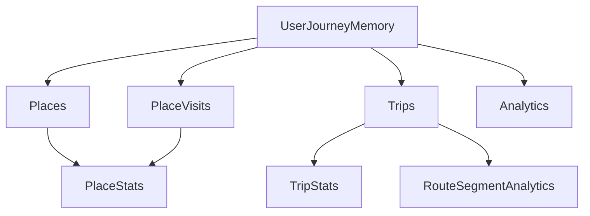
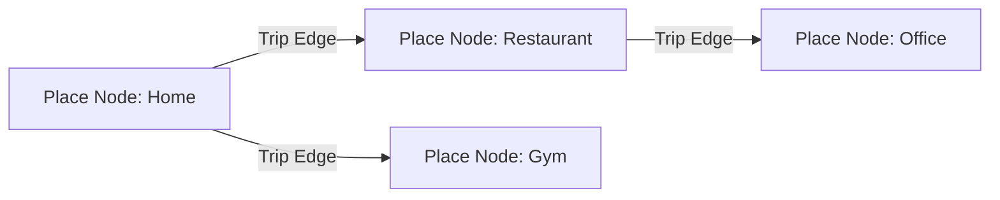
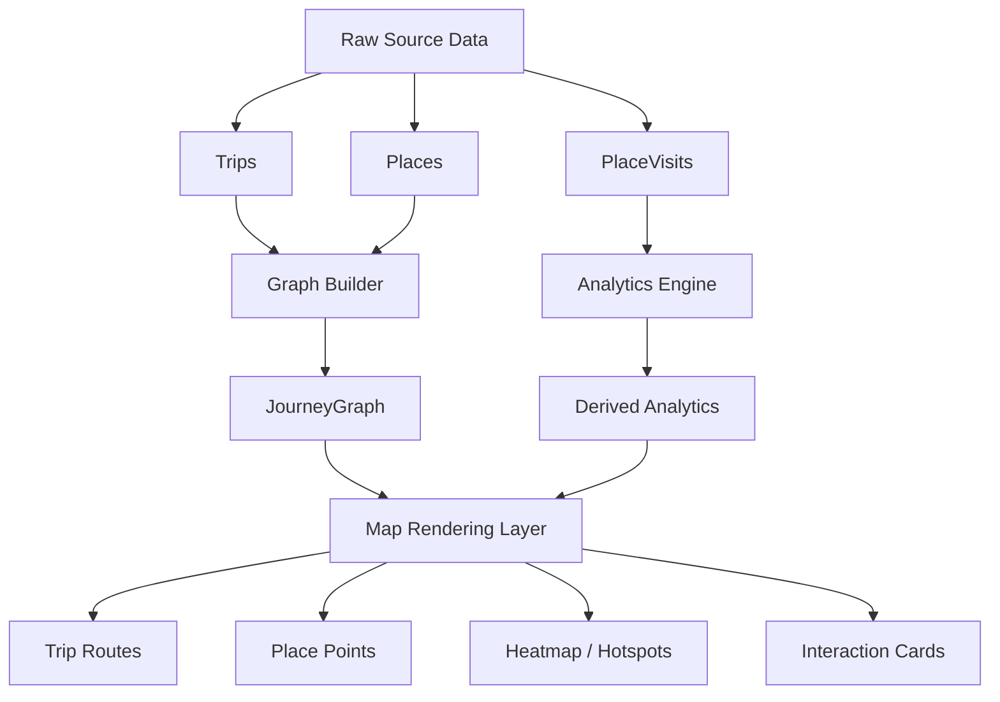
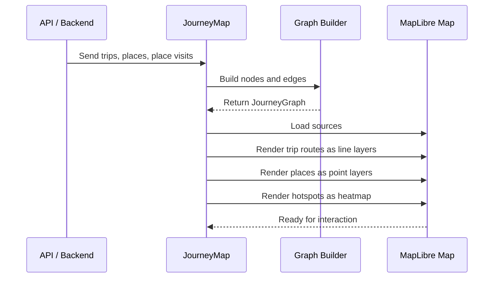
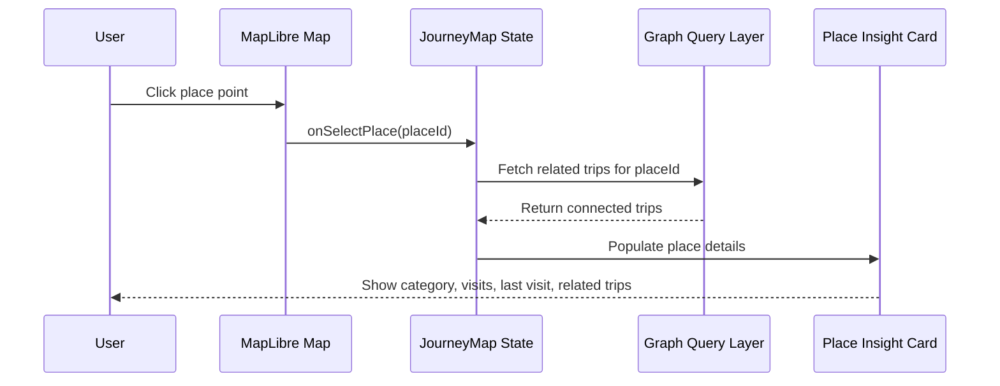
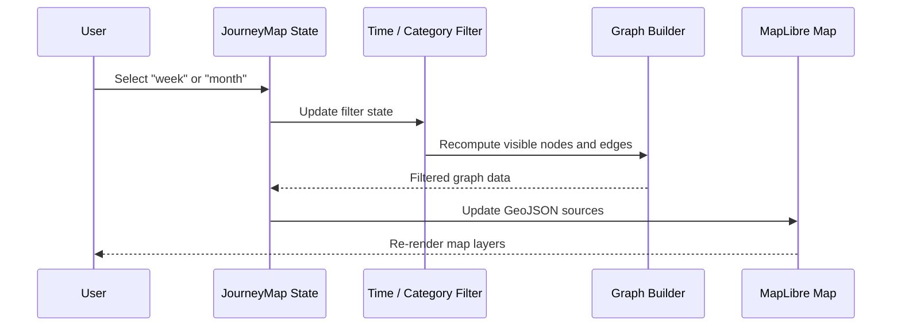
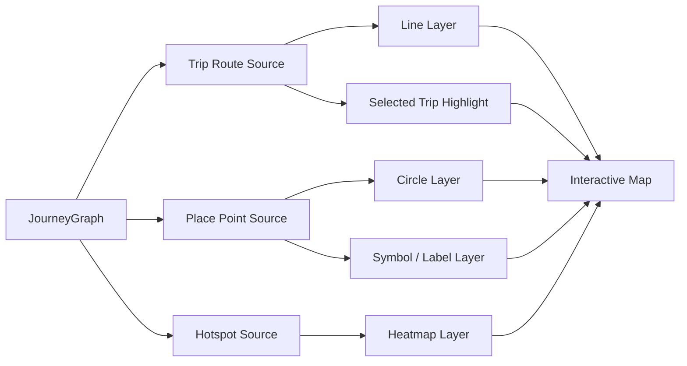
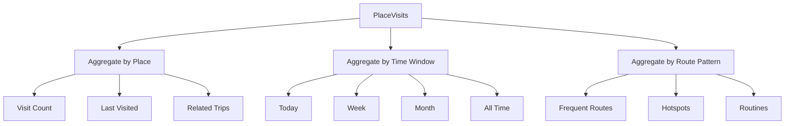

# Journey Map Flow Diagrams

## 1. Domain Composition

---

## 2. Graph Model

---

## 3. Data Flow

---

## 4. Sequence: Trip Render Lifecycle

---

## 5. Sequence: User Clicks a Place

---

## 6. Sequence: User Changes Time Filter

---

## 7. Rendering Architecture

---

## 8. Analytics Pipeline

