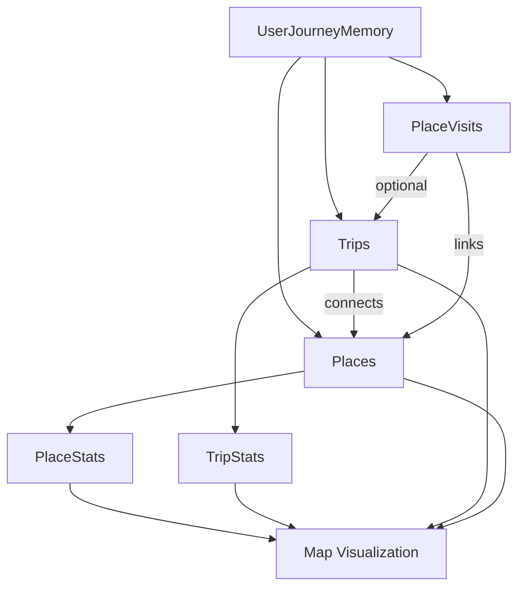

# System Design: Journey Map (Graph-Based Architecture)

## Overview
This system models a user's movement and places as a graph:
- Nodes = Places
- Edges = Trips
- Events = PlaceVisits

This enables rich visualization, analytics, and interaction.

---

## Core Data Model

### 1. UserJourneyMemory (Top-level container)
```ts
type UserJourneyMemory = {
  user_id: string;
  places: Place[];
  trips: Trip[];
  place_visits: PlaceVisit[];
  analytics?: JourneyAnalytics;
};
```

---

### 2. Place (Node)
```ts
type Place = {
  id: string;
  name: string;
  category: string;
  latitude: number;
  longitude: number;
  area?: string;
};
```

---

### 3. Trip (Edge)
```ts
type Trip = {
  id: string;
  public_id: string;
  title: string;
  start_time: string;
  end_time?: string;
  origin_place_id?: string;
  destination_place_id?: string;
  route_geojson?: {
    type: "Feature";
    geometry: {
      type: "LineString";
      coordinates: [number, number][];
    };
  };
};
```

---

### 4. PlaceVisit (Event Layer)
```ts
type PlaceVisit = {
  id: string;
  place_id: string;
  trip_id?: string;
  arrived_at: string;
  departed_at?: string;
  dwell_seconds?: number;
};
```

---

### 5. Analytics Layer (Derived)
```ts
type PlaceStats = {
  place_id: string;
  visit_count: number;
  last_visited_at: string;
  recent_trip_ids: string[];
};
```

---

## Graph Model

```ts
type JourneyGraph = {
  nodes: Record<string, Place>;
  edges: Trip[];
};
```

---

## Data Flow

1. Raw data collected:
   - Trips
   - Places
   - Visits

2. Transform into graph:
   - Places → Nodes
   - Trips → Edges

3. Render:
   - Nodes → Points
   - Edges → Lines
   - Aggregations → Heatmaps / thickness

---

## Rendering Layers

- Trip Routes (Line Layer)
- Selected Trip (Highlight Layer)
- Places (Circle Layer)
- Hotspots (Heatmap Layer)

---

## Key Capabilities

- Category filtering (restaurants, cafes, etc.)
- Time filtering (today, week, month, all)
- Graph traversal (next places, frequent routes)
- Pattern detection (hotspots, routines)

---

## Mermaid Diagram



---

## Summary

This design transforms:
- Lists of trips → Graph of movement
- Places → Persistent nodes
- Visits → Time-based events

Result:
A scalable, analytics-ready journey intelligence system.
